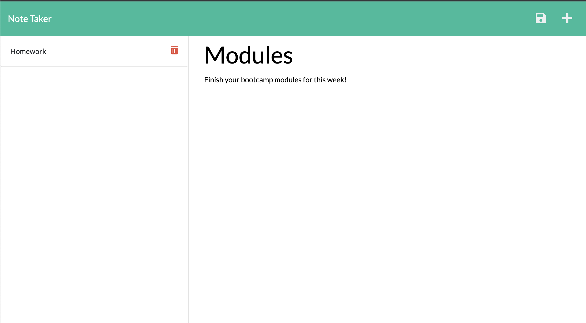

# Note Taker - Weekly Challenge 11

  

 ## Table of Contents 
  - [Description](#description)
  - [Installation](#installation)
  - [Usage](#usage)
  - [Tests](#tests)
  - [Credits](#credits)
  - [License](#license)
  

## Description 

The purpose of this week's challenge was to create an application that can be used to write and save notes using an Express.js back end. The Front end was already created and provided to us for the challenge.

Below are the challenge requirements:

- GIVEN a note-taking application
- WHEN I open the Note Taker
- THEN I am presented with a landing page with a link to a notes page
- WHEN I click on the link to the notes page
- THEN I am presented with a page with existing notes listed in the left-hand column, plus empty fields to enter a new note title and the note’s text in the right-hand column
- WHEN I enter a new note title and the note’s text
- THEN a Save icon appears in the navigation at the top of the page
- WHEN I click on the Save icon
- THEN the new note I have entered is saved and appears in the left-hand column with the other existing notes
- WHEN I click on an existing note in the list in the left-hand column
- THEN that note appears in the right-hand column
- WHEN I click on the Write icon in the navigation at the top of the page
- THEN I am presented with empty fields to enter a new note title and the note’s text in the right-hand column

 

Below is a screenshot of the deployed application:
 

 

## Installation

The user does not need to install anything in order to use the application, but in order to create the application both Node.js and the Express.js package were installed. The uuid package was also installed in order to generate unique ids.

## Usage 

This application can be used to write, save, and delete notes. The deployed application can be found [here](https://secret-citadel-81346.herokuapp.com/).

## Tests

No tests were conducted for this application.

## Credits

- AskBCS
- Various Classmates
- TA's
- [Node.js Documentation](https://nodejs.org/en/docs/)
- [Express.js Documentation](http://expressjs.com/en/4x/api.html)
- [UUID Documentation](https://www.npmjs.com/package/uuid)

## License

MIT License

Copyright (c) [2022] [Christopher Sarmiento-Salas]

Permission is hereby granted, free of charge, to any person obtaining a copy
of this software and associated documentation files (the "Software"), to deal
in the Software without restriction, including without limitation the rights
to use, copy, modify, merge, publish, distribute, sublicense, and/or sell
copies of the Software, and to permit persons to whom the Software is
furnished to do so, subject to the following conditions:

The above copyright notice and this permission notice shall be included in all
copies or substantial portions of the Software.

THE SOFTWARE IS PROVIDED "AS IS", WITHOUT WARRANTY OF ANY KIND, EXPRESS OR
IMPLIED, INCLUDING BUT NOT LIMITED TO THE WARRANTIES OF MERCHANTABILITY,
FITNESS FOR A PARTICULAR PURPOSE AND NONINFRINGEMENT. IN NO EVENT SHALL THE
AUTHORS OR COPYRIGHT HOLDERS BE LIABLE FOR ANY CLAIM, DAMAGES OR OTHER
LIABILITY, WHETHER IN AN ACTION OF CONTRACT, TORT OR OTHERWISE, ARISING FROM,
OUT OF OR IN CONNECTION WITH THE SOFTWARE OR THE USE OR OTHER DEALINGS IN THE
SOFTWARE.